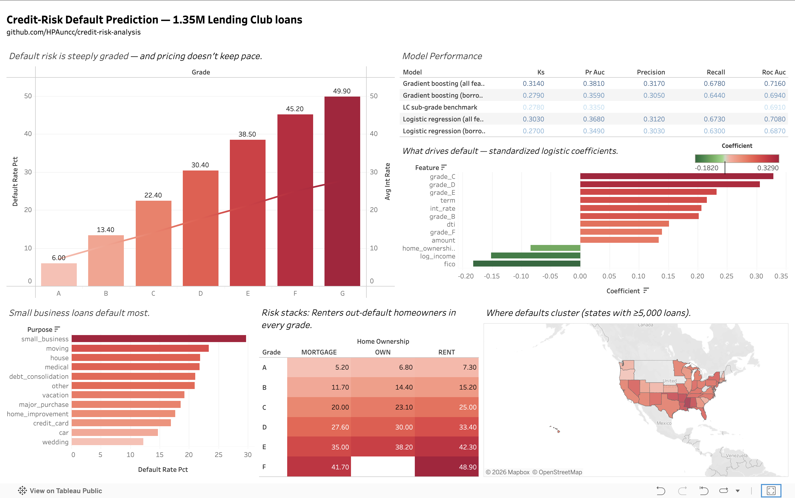

# Credit-Risk Default Prediction

Predicting consumer-loan default from borrower and loan attributes — built with **SQL**, **Python**, and **Tableau**.

> **TL;DR:** Designed a normalized SQL database of **1.35M** loans, quantified default risk by grade/purpose/segment, and trained models reaching **`<0.__>` ROC-AUC** to predict default. [Live dashboard](<TABLEAU_LINK>)

---

## Business question

Lenders make money by pricing risk correctly. This project asks: **which borrowers and loan characteristics drive default, and can a model flag high-risk loans before they're funded?** The goal is a defensible, interpretable view of credit risk — the kind a bank's risk or analytics team would act on.

## Data

- **Source:** [Lending Club loan data](https://www.kaggle.com/datasets/wordsforthewise/lending-club) (Kaggle) — accepted loans, 2007–2018.
- **Scope:** completed loans only — Fully Paid vs. Charged Off — giving **1,345,310 loans** with a **19.96%** overall default rate. Loans still in repayment have no final outcome and are excluded (which also means the most recent cohorts are partially censored).
- **Key fields:** loan amount, interest rate, grade/sub-grade, purpose, term, borrower income, DTI, FICO, employment length, home ownership.
- Raw data is gitignored; see `data/README.md` for the download steps.

## Approach

1. **SQL** — designed a normalized schema, loaded the data, and answered risk questions with joins, aggregations, and window functions.
2. **Modeling** — engineered features, then trained an interpretable baseline and a stronger model, handling class imbalance.
3. **Communication** — published an interactive Tableau dashboard and summarized findings for a lending decision.

## Key findings

**From the SQL analysis** ([sql/03_analysis.sql](sql/03_analysis.sql)):

- Risk is steeply and monotonically graded: grade **G** defaulted at **49.9%** vs. **20.0%** overall; grade A at just **6.0%**.
- Pricing doesn't keep pace with risk: only grade A's average interest rate (7.1%) exceeds its realized default rate — by grade G, a 27.7% average rate faces a 49.9% default rate.
- **Loan-to-income ratio** (engineered in SQL) is a clean monotonic driver: **12.5%** default in the lowest decile vs. **30.3%** in the highest.
- The **60-month term** adds risk within every grade — e.g. grade C defaults at 20.5% on 36-month loans vs. 27.5% on 60-month.
- Small-business loans are the riskiest purpose (**29.7%**), and renters out-default mortgage holders within every grade.
- Employment length barely moves default risk (20.5% → 18.8% across 0–10+ years) — a useful "what *doesn't* predict" result.

**From the models** (_fill in after the modeling phase_):

- Top default drivers: **`<feature 1>`, `<feature 2>`, `<feature 3>`**.
- Best model: **`<model>`**, ROC-AUC **`<0.__>`**, KS **`<0.__>`**.

## Repo structure

```
credit-risk-analysis/
├── README.md
├── requirements.txt
├── data/
│   ├── raw/            # original download (gitignored)
│   └── loans.db        # SQLite database built from raw
├── sql/
│   ├── 01_schema.sql   # CREATE TABLE statements
│   ├── 02_load.sql     # load CSV into tables
│   └── 03_analysis.sql # analytical queries (the showcase)
├── notebooks/
│   ├── eda.ipynb       # exploration + charts
│   └── model.ipynb     # modeling + evaluation
├── src/
│   ├── features.py     # feature engineering
│   └── train.py        # train + evaluate
└── dashboard/          # Tableau file / screenshots
```

## Schema

```sql
CREATE TABLE borrowers (
    borrower_id     INTEGER PRIMARY KEY,
    annual_income   REAL,
    emp_length      INTEGER,  -- years; 0 = under 1 year, 10 = 10+
    home_ownership  TEXT,
    state           TEXT,
    dti             REAL,     -- debt-to-income ratio (%)
    fico            REAL      -- midpoint of FICO range at issue
);

CREATE TABLE loans (
    loan_id      INTEGER PRIMARY KEY,
    borrower_id  INTEGER REFERENCES borrowers(borrower_id),
    amount       REAL,
    grade        TEXT,
    sub_grade    TEXT,
    int_rate     REAL,
    purpose      TEXT,
    term         INTEGER,
    issue_date   DATE,
    status       TEXT  -- 'paid' | 'default'
);
```

## Example query

```sql
-- Default rate and average interest rate by grade:
-- does pricing line up with realized risk?
SELECT l.grade,
       COUNT(*)                                              AS n_loans,
       ROUND(AVG(l.int_rate), 2)                             AS avg_rate,
       ROUND(100.0 * SUM(CASE WHEN l.status = 'default'
             THEN 1 ELSE 0 END) / COUNT(*), 1)              AS default_rate_pct
FROM loans l
GROUP BY l.grade
ORDER BY l.grade;
```

## Modeling

| Model | ROC-AUC | KS | Notes |
|-------|---------|----|-------|
| Logistic Regression | `<0.__>` | `<0.__>` | Interpretable baseline; coefficients = default drivers |
| Gradient Boosting | `<0.__>` | `<0.__>` | Higher accuracy; compared against baseline |

- Class imbalance handled via `<class weights / resampling>`.
- Evaluated with ROC-AUC, precision-recall, confusion matrix (framed as cost of a missed default vs. a rejected good borrower), and the KS statistic.

## Dashboard

Interactive Tableau Public dashboard: **[View it here](<TABLEAU_LINK>)**



## Reproduce

```bash
git clone <repo-url>
cd credit-risk-analysis
pip install -r requirements.txt

# 1. Build the database
sqlite3 data/loans.db < sql/01_schema.sql
sqlite3 data/loans.db < sql/02_load.sql

# 2. Run the analysis queries
sqlite3 data/loans.db < sql/03_analysis.sql

# 3. Train and evaluate
python src/train.py
```

## Tech stack

Python · pandas · scikit-learn · SQL (SQLite) · Tableau · matplotlib/seaborn

## About

Built by **Hampton Abbott** — B.S. Sports Analytics, UNC Charlotte.
[Portfolio](https://hamptonabbott.com) · [GitHub](https://github.com/HPAuncc) · [LinkedIn](https://www.linkedin.com/in/hamptonabbott)

## License

MIT
